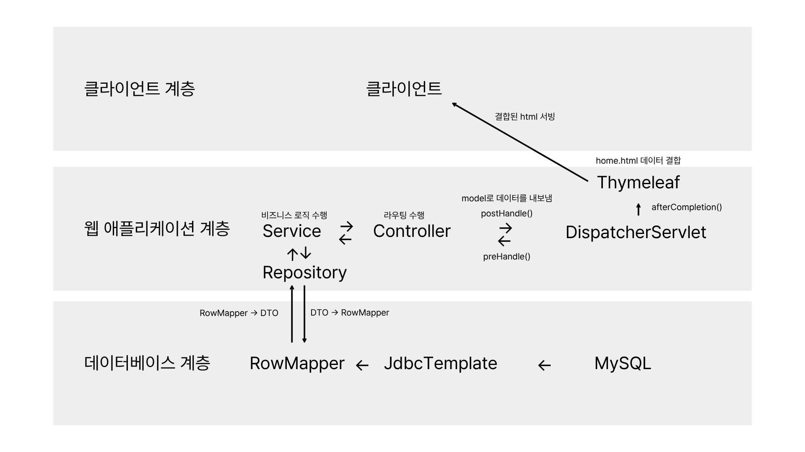

# 시스템 아키텍처 구상

## 1. 클라이언트 계층 (Presentation Layer)**
- HTML5, CSS3, JavaScript
- Thymeleaf Template Engine (Server-Side Rendering)

## 2. 애플리케이션 계층 (Application Layer)**
- Spring Boot Web (Spring MVC)
- Spring Security를 이용한 세션 기반 로그인 인증 및 URL 패턴별 인증 체크
- Controller / Service / Repository 계층 분리 3-Tier Layered Architecture

## 3. 데이터 계층 (Data Layer)**
- Spring JDBC (JdbcTemplate 기반 데이터 접근 및 RowMapper 데이터 매핑)
- MySQL Database

---

