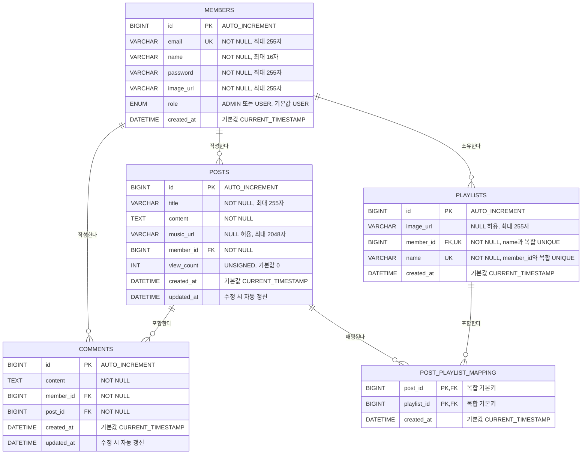

# ERD 다이어그램

## Mermaid 다이어그램



## SQL

```sql
-- 회원
CREATE TABLE IF NOT EXISTS members (
    id BIGINT NOT NULL AUTO_INCREMENT PRIMARY KEY,
    email VARCHAR(255) NOT NULL UNIQUE,
    name VARCHAR(16) NOT NULL,
    password VARCHAR(255) NOT NULL,
    image_url VARCHAR(255) NOT NULL,
    role ENUM('ADMIN', 'USER') NOT NULL DEFAULT 'USER',
    created_at DATETIME NOT NULL DEFAULT CURRENT_TIMESTAMP
    );

-- 게시글
CREATE TABLE IF NOT EXISTS posts (
    id BIGINT NOT NULL AUTO_INCREMENT PRIMARY KEY,
    title VARCHAR(255) NOT NULL,
    content TEXT NOT NULL,
    music_url VARCHAR(2048) NULL,
    member_id BIGINT NOT NULL,
    view_count INT UNSIGNED NOT NULL DEFAULT 0,
    created_at DATETIME NOT NULL DEFAULT CURRENT_TIMESTAMP,
    updated_at DATETIME NOT NULL DEFAULT CURRENT_TIMESTAMP ON UPDATE CURRENT_TIMESTAMP,

    CONSTRAINT fk_posts_member
    FOREIGN KEY (member_id)
    REFERENCES members (id)
    ON DELETE CASCADE,

    INDEX idx_posts_member_created_at (member_id, created_at),
    INDEX idx_posts_created_at (created_at)
    );

-- 댓글
CREATE TABLE IF NOT EXISTS comments (
    id BIGINT NOT NULL AUTO_INCREMENT PRIMARY KEY,
    content TEXT NOT NULL,
    member_id BIGINT NOT NULL,
    post_id BIGINT NOT NULL,
    created_at DATETIME NOT NULL DEFAULT CURRENT_TIMESTAMP,
    updated_at DATETIME NOT NULL DEFAULT CURRENT_TIMESTAMP ON UPDATE CURRENT_TIMESTAMP,
    
    CONSTRAINT fk_comments_member
    FOREIGN KEY (member_id)
    REFERENCES members (id)
    ON DELETE CASCADE,

    CONSTRAINT fk_comments_post
    FOREIGN KEY (post_id)
    REFERENCES posts (id)
    ON DELETE CASCADE,

    INDEX idx_comments_post_created_at (post_id, created_at),
    INDEX idx_comments_member_id (member_id)
    );

-- 플레이리스트
CREATE TABLE IF NOT EXISTS playlists (
    id BIGINT NOT NULL AUTO_INCREMENT PRIMARY KEY,
    image_url VARCHAR(255) NULL,
    member_id BIGINT NOT NULL,
    name VARCHAR(255) NOT NULL,
    created_at DATETIME NOT NULL DEFAULT CURRENT_TIMESTAMP,

    CONSTRAINT fk_playlists_member
    FOREIGN KEY (member_id)
    REFERENCES members (id)
    ON DELETE CASCADE,

    CONSTRAINT uk_playlists_member_name
    UNIQUE (member_id, name),

    INDEX idx_playlists_member_id (member_id)
    );

-- 게시글 <-> 플레이리스트 매핑 테이블
CREATE TABLE IF NOT EXISTS post_playlist_mapping (
    post_id BIGINT NOT NULL,
    playlist_id BIGINT NOT NULL,
    created_at DATETIME NOT NULL DEFAULT CURRENT_TIMESTAMP,

    PRIMARY KEY (post_id, playlist_id),

    CONSTRAINT fk_mapping_post
    FOREIGN KEY (post_id)
    REFERENCES posts (id)
    ON DELETE CASCADE,

    CONSTRAINT fk_mapping_playlist
    FOREIGN KEY (playlist_id)
    REFERENCES playlists (id)
    ON DELETE CASCADE,

    INDEX idx_mapping_playlist_id (playlist_id)
    );
```