# 화면 설계서

## 주요 화면 목록

| 화면 | Method | URL | Template | Layout |
| --- | --- | --- | --- | --- |
| 메인화면 (Home) | `GET` | `/` | `pages/home.html` | base |
| 게시글 상세 (Post Detail) | `GET` | `/posts/{postId}` | `pages/post-detail.html` | base |
| 게시글 작성 (Post Create) | `GET` | `/posts/new` | `pages/post-create.html` | base |
| 게시글 수정 (Post Edit) | `GET` | `/posts/{postId}/edit` | `pages/post-edit.html` | base |
| 플레이리스트 상세 (Playlist Detail) | `GET` | `/playlists/{playlistId}` | `pages/playlist-detail.html` | base |
| 플레이리스트 생성 (Playlist Create) | `GET` | `/playlists/new` | `pages/playlist-create.html` | base |
| 플레이리스트 수정 (Playlist Edit) | `GET` | `/playlists/{playlistId}/edit` | `pages/playlist-edit.html` | base |
| 로그인 (Login) | `GET` | `/login` | `pages/auth/login.html` | auth |
| 회원가입 (Signup) | `GET` | `/signup` | `pages/auth/signup.html` | auth |
| 마이페이지 (My Page) | `GET` | `/mypage` | `pages/mypage.html` | base |

## 공통 조건

- 비회원은 `/` 페이지의 게시글 목록 조회와 `/posts/{post_id}/` 게시글 상세 조회, `/signup` , `/login` 페이지 외에는 접근 불가

## 공통 nav

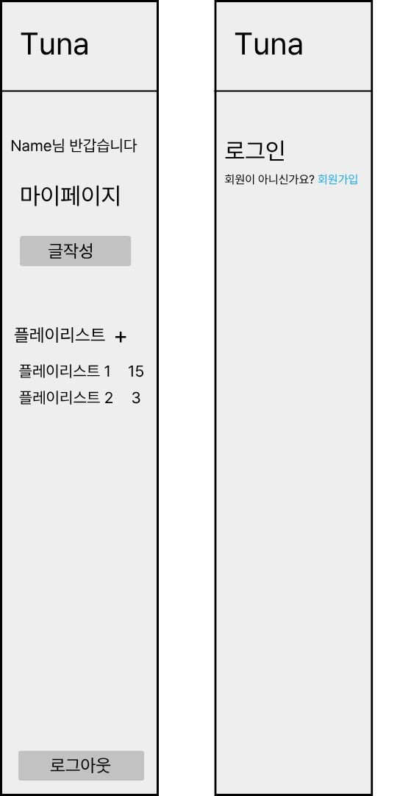

- 출력 항목
    - 로그인 안된 상태: 로그인 버튼, 회원가입 버튼만 출력
    - 로그인 된 상태: 회원 이름, 마이페이지 버튼, 글작성 버튼, 플레이리스트 생성 버튼, 플레이리스트 목록, 로그아웃 버튼
    - 해당 nav 영역은 존재하는 다른 화면들에서도 공통적으로 적용
- 화면 제어 및 권한 규칙
    - 왼쪽의 nav는 인증이 완료된 사용자, 오른쪽의 경우 인증이 되지 않는 사용자입니다.
    - 왼쪽 최상단의 Tuna 버튼: `/` 페이지로 이동합니다.
    - 마이페이지 버튼: `/mypage` 로 이동됩니다.
    - 플레이리스트
        - `+` 버튼: `/playlists/new` 로 이동됩니다.
        - 1 버튼: `/playlists/{playlist_id}` 페이지로 이동됩니다. {playlist_id}는 playlist 테이블의 id
        - 2 버튼: 플레이리스트 1 항목과 같은 내용입니다. 플레이리스트는 유저당 10개 가질 수 있습니다.
    - 로그아웃 버튼: 회원의 인증을 해제합니다. alert으로 로그아웃을 하시겠습니까? (예 / 아니요) 를 출력 합니다.

## 메인화면 (Home)

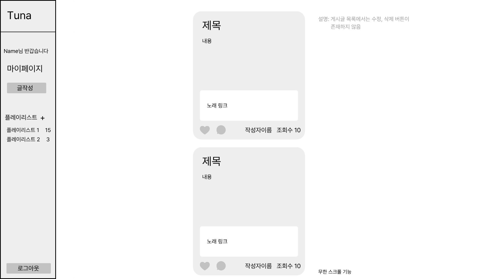

- 출력 항목
    - 게시글 목록 영역: 제목, 내용, 링크, 작성자 이름, 조회수 → 게시글 전체 목록 조회
- 입력 데이터 및 검증 규칙 (Input Data & Validation):
    - `/` 페이지는 입력 데이터가 존재 하지 않아 검증 규칙 또한 없습니다.
- 화면 제어 및 권한 규칙(Behavior Rules):
    - 게시글 목록 영역
        - 게시글 카드 영역 전체: 게시글 상세(`/posts/{postId}`)로 이동
        - 하트 버튼: 플레이리스트 팝업창을 띄워서 추가할 플레이리스트를 선택
        - 댓글 버튼: 게시글의 댓글 영역(`/posts/{post_id}#comments`)으로 이동

## 게시글 상세 (Post Detail)

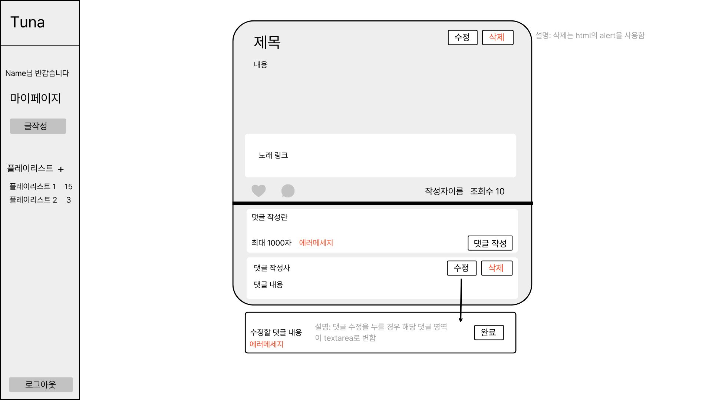

- 출력 항목
    - 게시글 본문 영역: 게시글 정보 (제목, 내용, 노래 링크, 작성자 이름, 조회수)
    - 댓글 영역: 댓글 정보 (댓글 작성자, 댓글 내용)
- 댓글 - 입력 및 검증 규칙
    - 댓글 내용: 필수 입력 항목, 최대 1000자 이하
- 화면 제어 및 권한 규칙
    - 게시글 본문 영역
        - 수정 버튼: 게시글 수정 화면(`/posts/{postId}/edit`)으로 이동
        - 삭제 버튼: 알림창으로 한번 더 확인 절차를 가진 뒤 “예”를 누르면 게시글 삭제후 메인화면(`/`)으로 이동
        - 하트 버튼: 플레이리스트 팝업창을 띄워서 추가할 플레이리스트를 선택
        - 댓글 버튼: 게시글의 댓글 영역(`/posts/{post_id}#comments`)으로 이동
    - 댓글 영역
        - 댓글 작성 버튼: 유효성 검증 후 댓글 등록 처리, 게시글 새로고침(`/posts/{postId}`리다이렉트)
        - 수정 버튼: 해당 댓글 영역이 textarea로 변경
            - 완료 버튼: 유효성 검증 후 댓글 등록 처리, 게시글 새로고침(`/posts/{postId}`리다이렉트)
        - 삭제 버튼: 알림창으로 한번 더 확인 절차를 가진 뒤 “예”를 누르면 댓글 삭제, 게시글 새로고침(`/posts/{postId}`리다이렉트)

## 플레이리스트 노래 추가 팝업

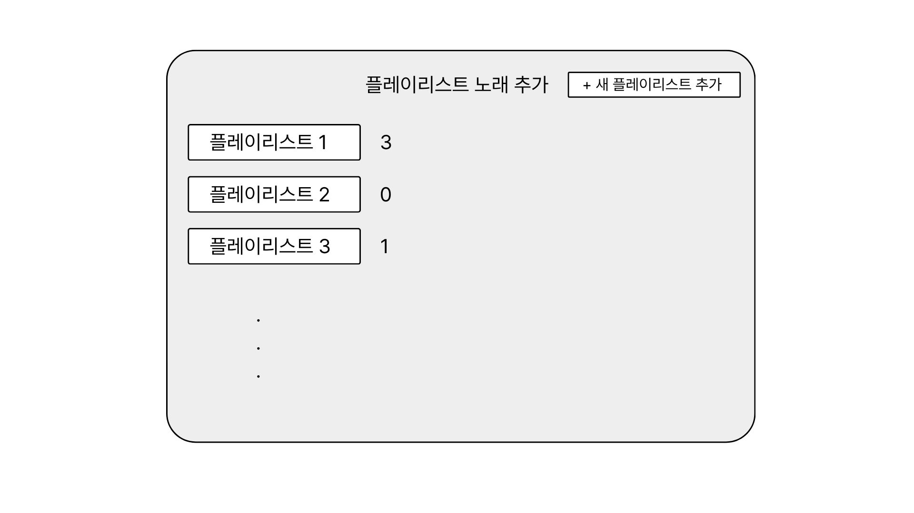

- 출력 항목:
    - 플레이리스트 목록 조회
    - 플레이리스트 내부 post 개수 count
- 입력 데이터 및 검증 규칙:
    - 항목 없음
- 화면 제어 및 권한 규칙 (Behavior Rules):
    - home 화면의 플레이리스트 추가 버튼(설계서 상에서 하트 모양)을 누를 경우 해당 팝업이 출력
    - 새 플레이리스트 추가: `/playlists/new` 페이지로 이동
    - 플레이리스트 1~3: 각 개인이 소유한 플레이리스트 항목. 없을 경우 ‘플레이리스트가 존재하지 않습니다.’ 출력 해당 플레이리스트를 누를 경우 팝업이 꺼지고 ‘추가 되었습니다’ alert 생성

## 게시글 작성 (Post Create)

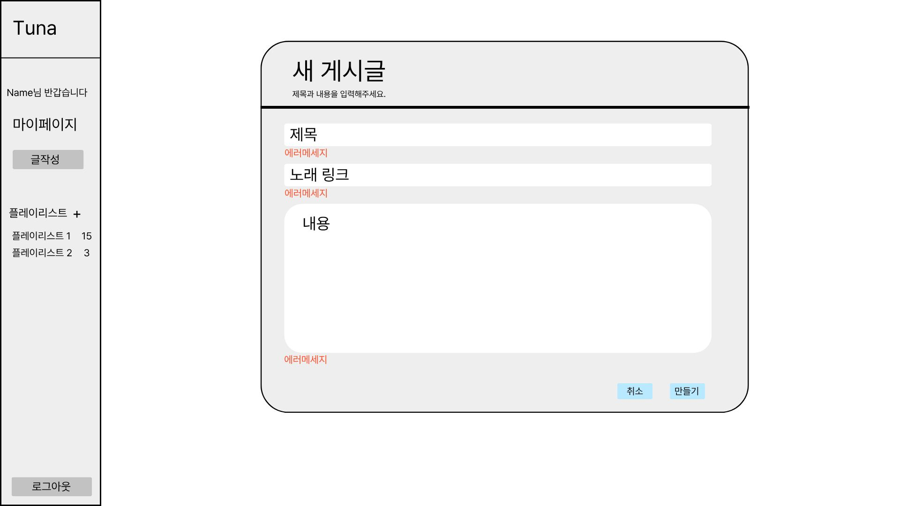

- 출력 항목
    - 항목 없음
- 입력 데이터 및 검증 규칙 (Input Data & Validation):
    - 제목 : 필수 입력 항목(최소 1자에서 최대 100자)
    - 노래 링크 : URL형식의 링크만 작성 가능
    - 내용 : 필수 입력 항목(최소 1자)
- 화면 제어 및 권한 규칙(Behavior Rules):
    - 취소 버튼 :  `/` 페이지로 이동합니다.
    - 만들기 버튼 : 유효성 검증 후 게시물 등록 처리, 게시글 상세보기 페이지로 이동

## 게시글 수정 (Post Edit)

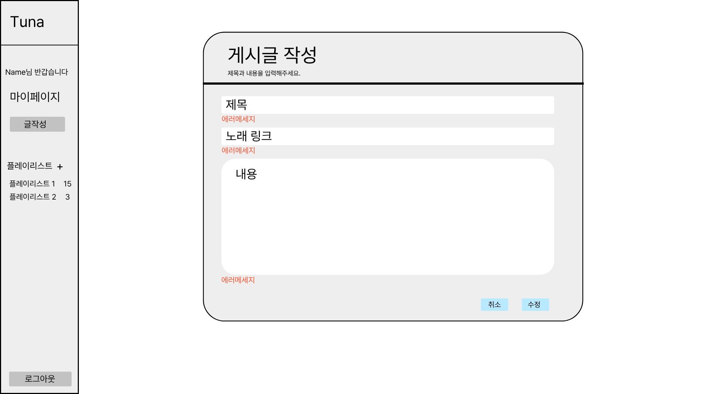

- 출력 항목
    - 항목 없음
- 입력 데이터 및 검증 규칙 (Input Data & Validation):
    - 제목: 필수 입력 항목 (최소 1자에서 최대 100자)
    - 노래 링크 : URL 형식의 링크만 작성 가능
    - 내용: 필수 입력 항목 (최소 1자)
- 화면 제어 및 권한 규칙(Behavior Rules):
    - 인증이 된 사용자만 사용 가능
    - 취소: `/` 로 이동
    - 수정:  성공 시`/posts/{post_id}` 로 리다이렉트

## 플레이리스트 상세 (Playlist Detail)

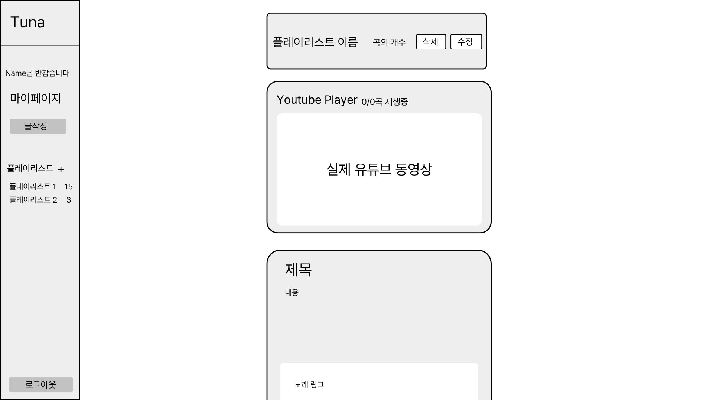

- 출력 항목
    - 플레이리스트 상세 조회
        - 게시글 목록 조회
- 입력 데이터 및 검증 규칙 (Input Data & Validation):
    - 항목 없음
- 화면 제어 및 권한 규칙(Behavior Rules):
    - 삭제: 삭제 버튼을 누를 경우 alert으로 삭제 하시겠습니까? (예 / 아니요) 표시 본인 또는 관리자 권한이 필요함
    - 수정: `/playlists/{playlist_id}/edit` 페이지로 이동 본인 또는 관리자 권한이 필요함
    - 실제 유튜브 영상은 youtube iframe api를 따름 (static/js/youtube-playlist-player.js)

## 플레이리스트 생성 (Playlist Create)

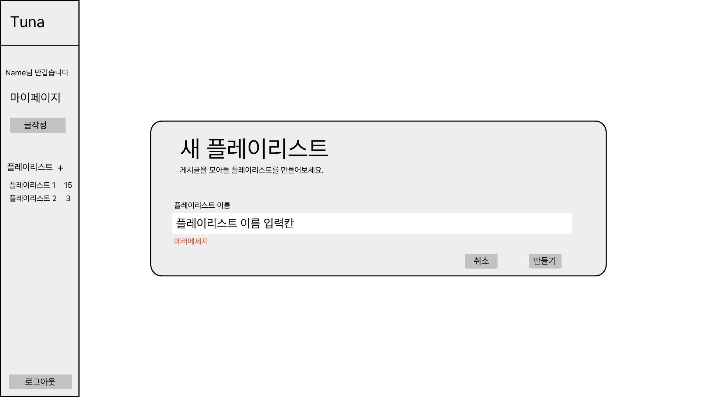

- 출력 항목
    - 항목 없음
- 입력 데이터 및 검증 규칙 (Input Data & Validation):
    - 플레이리스트 이름: 최소 1자에서 30자까지 입력, 사용자의 플레이리스트 중 중복된 이름 사용 불가, 문자 허용 규칙은 다음 정규식을 따름: ^[A-Za-z가-힣0-9]+$
- 화면 제어 및 권한 규칙(Behavior Rules):
    - 본문 영역:
        - 취소: `/` 로 이동
        - 만들기: `/playlists/new` 로 post 요청 후 생성이 성공되면`/playlists/{playlist_id}` 로 이동 실패시 다시 `playlists/new` 로 리다이렉트 후 에러 메세지 출력

## 플레이리스트 수정 (Playlist Edit)

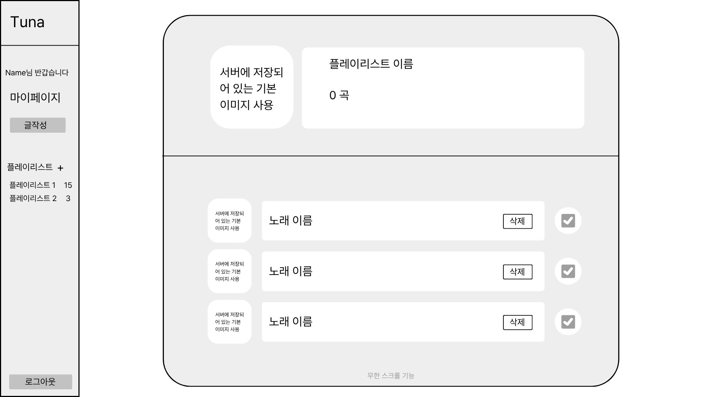

- 출력 항목
    - 플레이리스트 상세 조회
        - 플레이리스트 이름
        - 플레이리스트 내부의 post 개수 (count)
        - post 목록 조회
- 입력 데이터 및 검증 규칙 (Input Data & Validation):
    - 플레이리스트 이름: 최소 1자에서 최대 30자까지 입력, 사용자의 플레이리스트 중 중복된 이름 사용 불가, 문자 허용 규칙은 다음 정규식을 따름: ^[A-Za-z가-힣0-9]+$
- 화면 제어 및 권한 규칙(Behavior Rules):
    - 본문 영역
        - 전체 삭제: `/playlists/{playlist_id}/delete` delete 메서드 요청 후 `/playlists/{playlist_id}/edit` 로 리다이렉트
        - 선택 삭제: `/playlists/{playlist_id}/delete` delete 메서드 요청 후 `/playlists/{playlist_id}/edit` 로 리다이렉트
        - 단일 노래 삭제: 삭제 후 `/playlists/{playlist_id}/edit` 으로 리다이렉트

## 로그인 (Login)

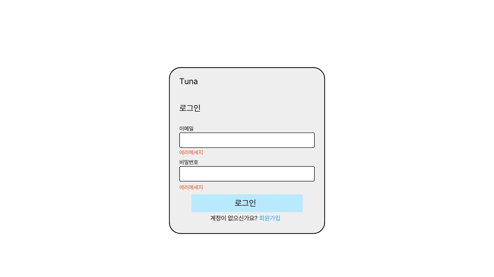

- 출력 항목
    - 없음
- 입력 데이터 및 검증 규칙 (Input Data & Validation):
    - 이메일 : 필수 입력 항목, 최소 4자 ~ 최대 50자 이하
    - 비밀번호 : 필수 입력 항목, 최소 8자 ~ 최대 50자 이하
- 화면 제어 및 권한 규칙(Behavior Rules):
    - 로그인 버튼 클릭 시 루트 페이지로 이동
    - 회원가입 버튼 클릭 시 회원가입 페이지로 이동

## 회원가입 (Signin)

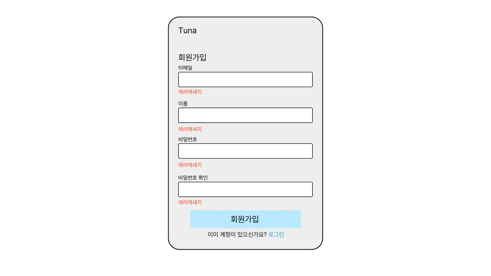

- 출력 항목
    - 없음
- 입력 데이터 및 검증 규칙 (Input Data & Validation):
    - 이메일: 필수 입력 항목, 이메일 형식의 영문/숫자/”@”,”.” 조합 4~50자, 중복 불가
    - 이름: 필수 입력 항목, 2~10자
    - 비밀번호: 필수 입력 항목, 8~50자
    - 비밀번호 확인: 필수 입력 항목, 8~50자, 비밀번호와 같아야 함
- 화면 제어 및 권한 규칙(Behavior Rules):
    - 회원가입 버튼 (`POST`, `/signup`)
        - 유효성 성립: 회원 정보 등록, 로그인 페이지로 리다이렉트
        - 유효성 불가: 회원가입 페이지 새로고침(리다이렉트), 에러메세지 출력
    - 로그인 버튼: 로그인 페이지(`/login`)로 이동

## 마이페이지 (My Page)

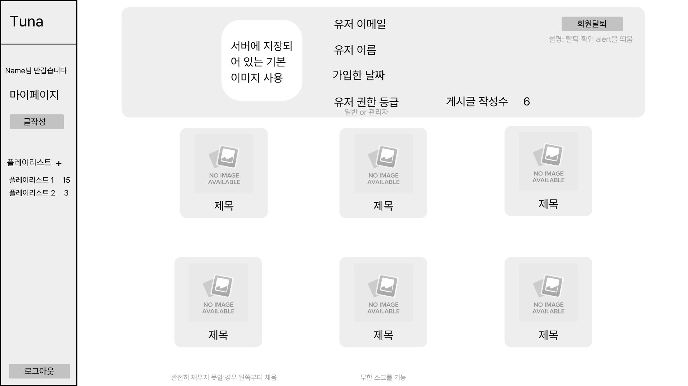

- 출력 항목
    - 사용자 영역 : 회원가입 시 저장된 사용자 정보 (이메일, 이름 , 가입날짜, 권한등급, 게시글 작성수)
    - 게시글 영역 : 게시글 정보 (제목, 사진)
- 입력 데이터 및 검증 규칙 (Input Data & Validation):
    - 해당 없음
- 화면 제어 및 권한 규칙(Behavior Rules):
    - 로그인 인증 세션 존재시에만 접근 허용